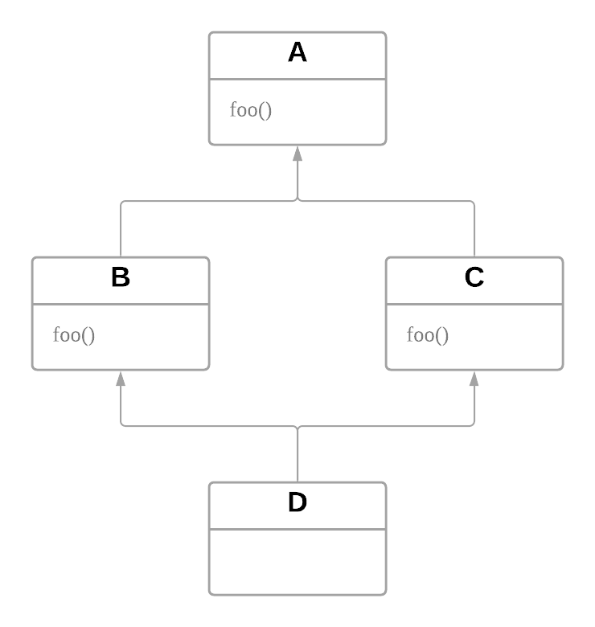

# 죽음의 다이아몬드

프로그래밍을 하다 보면 우리는 상위 클래스의 멤버들을 하위 클래스에 물려받는 상속이라는 행위를 한다. 보통은 하나의 부모 클래스만 상속받지만 종종 아래 그림과 같이 여러 부모 클래스를 상속받는 경우가 있다. 만약 여기서 우리가 `D` 클래스에서 상속받은 `foo` 메서드를 호출했다면 어느 부모 클래스에 있는 메서드를 호출해야 할까? `B`? 아니면 `C`? 그것도 아니면 둘 다? 만약 둘 다 호출한다면 어떤 클래스의 메서드를 먼저 호출해야 할까? 답이 없을 것이다. 이런 애매모호한 다중 상속 구조를 **죽음의 다이아몬드**라 한다.



# 메서드 결정 순서

이런 문제를 피하기 위해 일부 프로그래밍 언어는 다중 상속을 허용하지 않는다. 하지만 Python은 다중 상속을 허용하고 있는데 위와 같은 죽음의 다이아몬드 문제를 피하기 위해 메서드 결정 순서(Method Resolution Order, 이하 MRO)라는 것을 2.2버전부터 도입했다. MRO는 상속받은 메서드를 호출했을 때 어떤 부모 클래스를 먼저 호출할지 결정하는 시스템이다. Python에 MRO는 2.2버전에 처음 도입되었으나 [교차 상속 문제를 제대로 해결하지 못한 관계](https://www.python.org/download/releases/2.3/mro/#the-beginning)로 2.3에서 [C3 선형화](https://en.wikipedia.org/wiki/C3_linearization)라는 MRO 알고리즘으로 변경된 이후 유지되고 있다. 

## 동작 방식

파이썬의 MRO는 간단하게 동작한다. 호출된 자식 클래스를 먼저 확인하고 그다음에는 상속된 클래스들을 나열한 순서대로 확인한다. 만약 아래의 코드를 실행한다면 아래와 같이 동작할 것이다.

1. 먼저 `D.foo()`를 확인한다. `D` 클래스에 `foo()` 메서드가 존재하지 않으므로 부모 클래스를 확인한다. `(B, C)` 순으로 나열했으니 B 클래스를 먼저 확인한다.
2. `B.foo()`를 호출한다. `super().foo()`는 바로 실행되지 않고 MRO 순서를 따른다. (이를 통해 중복 호출이 방지된다)
3. `C.foo()`를 호출한다.
4. `A.foo()`를 호출한다.

```python
class A:
  def foo(self):
    print('A.foo() called')


class B(A):
  def foo(self):
    print('B.foo() called')
    super().foo()


class C(A):
  def foo(self):
    print('C.foo() called')
    super().foo()


class D(B, C):
  pass


D().foo()
>>> 'B.foo() called'
>>> 'C.foo() called'
>>> 'A.foo() called'
```

MRO을 조금 더 확실하게 알 수 있는 방법은 클래스의 `mro()` 정적 메서드를 호출하거나 `__mro__` 속성에 접근하여 MRO를 확인하는 것이다. (두 방식이 온전히 동일한 작업을 하는 것은 아니나 같은 결과를 얻을 것이다)

> Python 3부터는 모든 클래스들이 기본적으로 `object`를 상속하지만, 이전에는 `object`를 상속받은 클래스는 클래스, 상속받지 않은 클래스는 타입으로 정의했다. `mro()` 메서드와 `__mro__` 속성은 `object`를 상속받은 클래스에만 존재한다.

```python
D.mro()
>>> [<class '__main__.D'>, <class '__main__.B'>, <class '__main__.C'>, <class '__main__.A'>, <class 'object'>]
```

## 교차 상속

앞서 말했듯 죽음의 다이아몬드 문제를 피하기 위해 중복 상속은 허용하나 교차 상속은 허용하지 않는다.

아래와 같이 `C`와 `D` 모두 A와 B를 상속받으나 상속받는 순서가 다르다. 이런 경우에는 어떤 클래스를 먼저 방문해야 하는지 선형화하기 모호하므로 오류를 발생시킨다. 만약 `class D(A, B)`였다면 이 코드는 정상적으로 작동할 것이다.

```python
class A:
  pass

class B:
  pass

class C(A, B):
  pass

class D(B, A):
  pass

class E(C, D):
  pass

>>> TypeError: Cannot create a consistent method resolution
>>> order (MRO) for bases A, B
```
